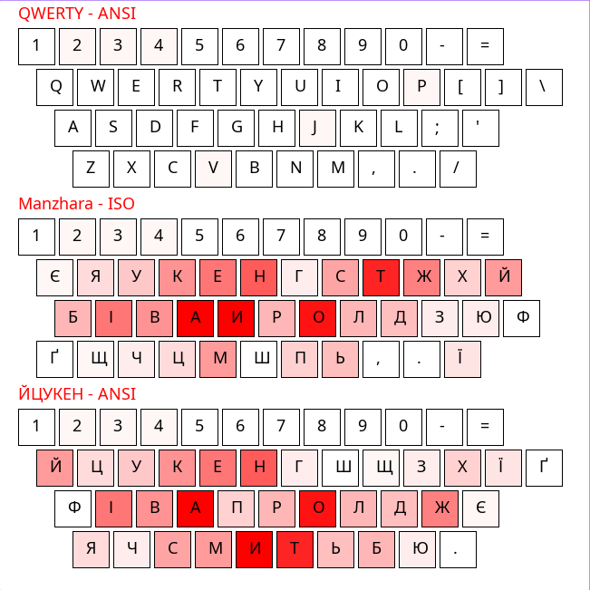

[](https://github.com/dhvakr/keylogger-in-java/blob/main/LICENSE)
[](https://www.oracle.com/java/)

[](https://github.com/dhvakr/keylogger-in-java/graphs/commit-activity)



# Java-Keylogger
This is a fork key logger with visualisation. Base on a simple keylogger application implemented in Java. Origin repo [here](https://github.com/dhvakr/Keylogger-In-Java). It also uses [Native Hook](https://github.com/kwhat/jnativehook) library to add global listener for key presses.

## How to Build and Run Project
TO build project: 
```bash
mvn package
```
Run ./target/keylogger-jar-with-dependencies.jar file using command:
```bash
java -jar `./target/keylogger-jar-with-dependencies.jar`
```
The keys will be written in **`keys.txt`** file and application logs will reside inside **`all.log`** file.

## Note 
Don't forget to stop the keylogger application after you've done logging.
